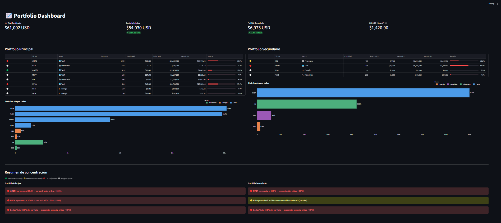

# CEDEAR Control

Dashboard para seguimiento de portfolios de inversión en CEDEARs, con cálculo automático del valor en dólares MEP.

[](https://cedear-control-mpp8i7vzq4k6fqxrjkbknc.streamlit.app/)


---



---

## Funcionalidades

- **Dólar MEP automático** — obtiene la cotización en tiempo real desde múltiples fuentes (Bluelytics, DolarAPI) con fallback manual y caché de 5 minutos
- **Dos portfolios simultáneos** — visualización lado a lado del portfolio principal y el secundario
- **Valor USD por posición** — calcula `valor_usd = (precio_ars × cantidad) / dolar_mep` para cada CEDEAR
- **Gráficos interactivos** — distribución porcentual por posición con Plotly
- **Comparación de portfolios** — totales en ARS y USD de ambas carteras en una sola pantalla

## Stack tecnológico

| Tecnología | Uso |
|---|---|
| Python 3.10+ | Lenguaje base |
| Streamlit | Interfaz web / dashboard |
| Pandas | Manipulación de datos |
| Plotly Express | Gráficos interactivos |
| Requests | Consulta a APIs de cotización |

## Instalación y uso local

```bash
# 1. Clonar el repositorio
git clone https://github.com/tu-usuario/cedear-control.git
cd cedear-control

# 2. Crear entorno virtual
python -m venv .venv
source .venv/bin/activate      # Linux/Mac
.venv\Scripts\activate         # Windows

# 3. Instalar dependencias
pip install streamlit pandas plotly requests

# 4. Configurar el portfolio (ver sección siguiente)

# 5. Ejecutar
streamlit run app.py
```

El dashboard queda disponible en `http://localhost:8501`.

## Configurar el portfolio

Los datos personales (posiciones y precios) **no se suben a GitHub**. El archivo `portfolio.json` está en `.gitignore`.

```bash
cp portfolio.example.json portfolio.json
```

Luego editá `portfolio.json` con tus CEDEARs, cantidades y precios en ARS:

```json
{
  "precios_ars": {
    "AAPL": 18000,
    "MSFT": 17000
  },
  "portfolio_principal": {
    "AAPL": 100,
    "MSFT": 50
  },
  "portfolio_secundario": {
    "MSFT": 30
  }
}
```

> `portfolio.example.json` se incluye en el repositorio como plantilla con datos ficticios.

## Construido con Claude Code

Este proyecto fue desarrollado de forma iterativa usando [Claude Code](https://claude.ai/code), el CLI de Anthropic para tareas de ingeniería de software. El proceso incluyó:

1. **Diseño inicial** del dashboard en Streamlit con datos estáticos
2. **Integración del dólar MEP** con múltiples fuentes y lógica de fallback
3. **Exploración de APIs** de brokers argentinos (PPI, IOL) para precios en tiempo real
4. **Refinamiento** del layout, gráficos y fórmulas de cálculo

Claude Code permitió avanzar rápidamente sobre decisiones de arquitectura, depurar integraciones con APIs externas y mantener el código limpio en cada iteración.

## Próximas mejoras

- [ ] **Precios en tiempo real vía API PPI** — reemplazar los precios hardcodeados por cotizaciones en vivo desde la API de Portfolio Personal Inversiones
- [ ] **Historial de valuación** — guardar snapshots diarios para ver la evolución del portfolio en el tiempo
- [ ] **Alertas de precio** — notificación cuando un CEDEAR supere o baje de un umbral definido
- [ ] **Exportación a CSV/Excel** — descargar el estado actual del portfolio

---

> Los portfolios y cantidades reflejan posiciones reales. No modificar sin consultar primero.
